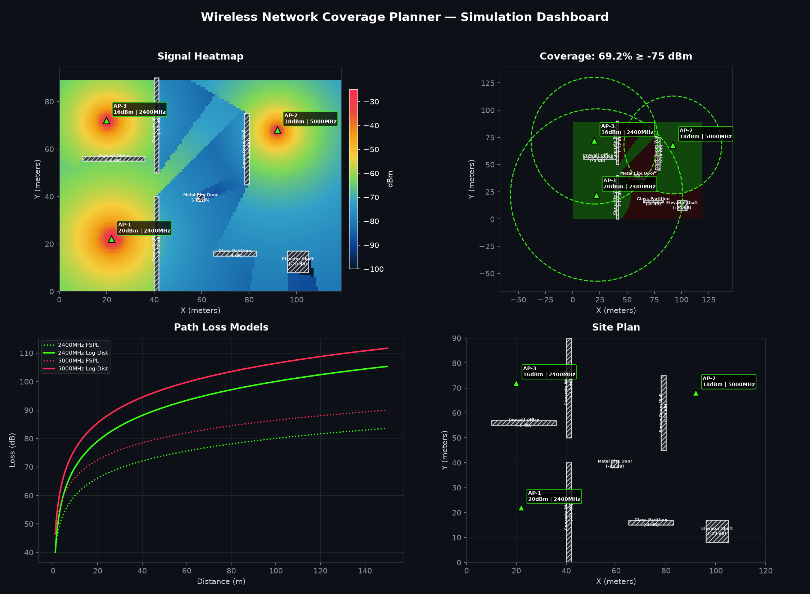
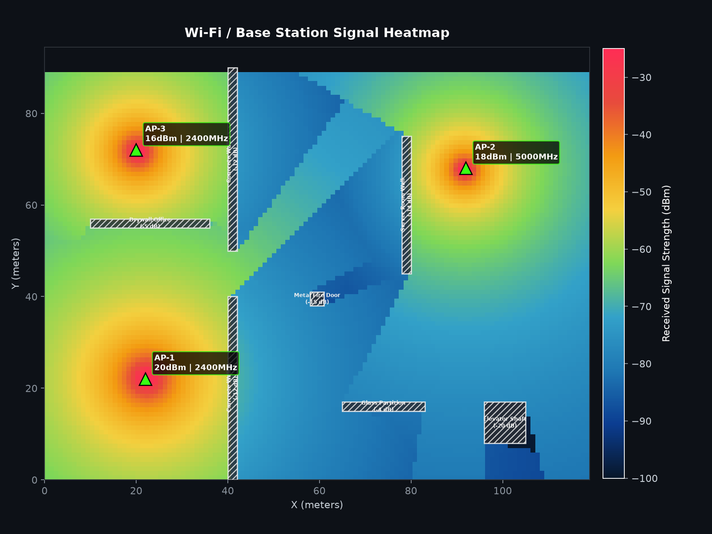
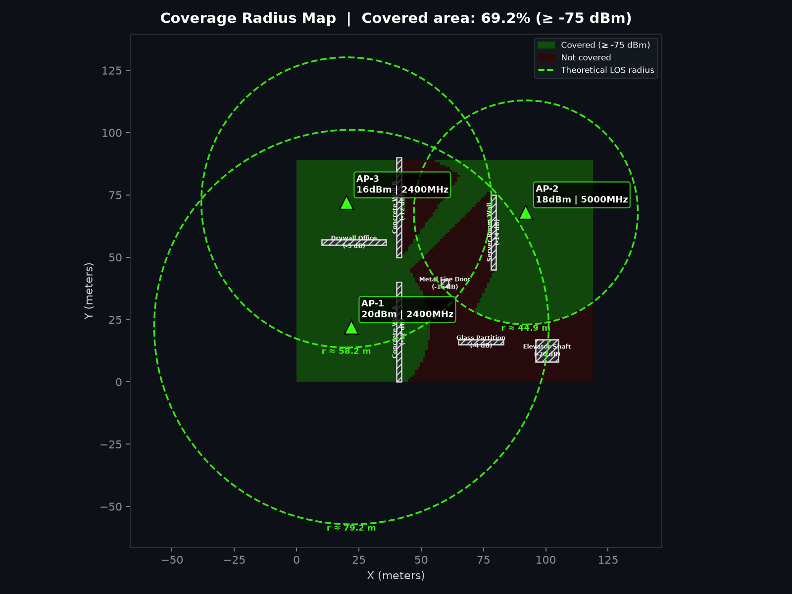
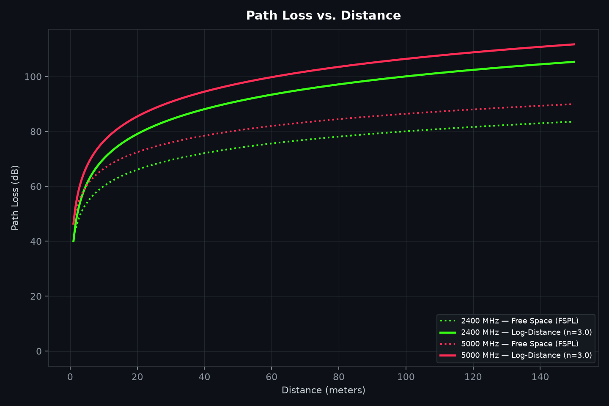
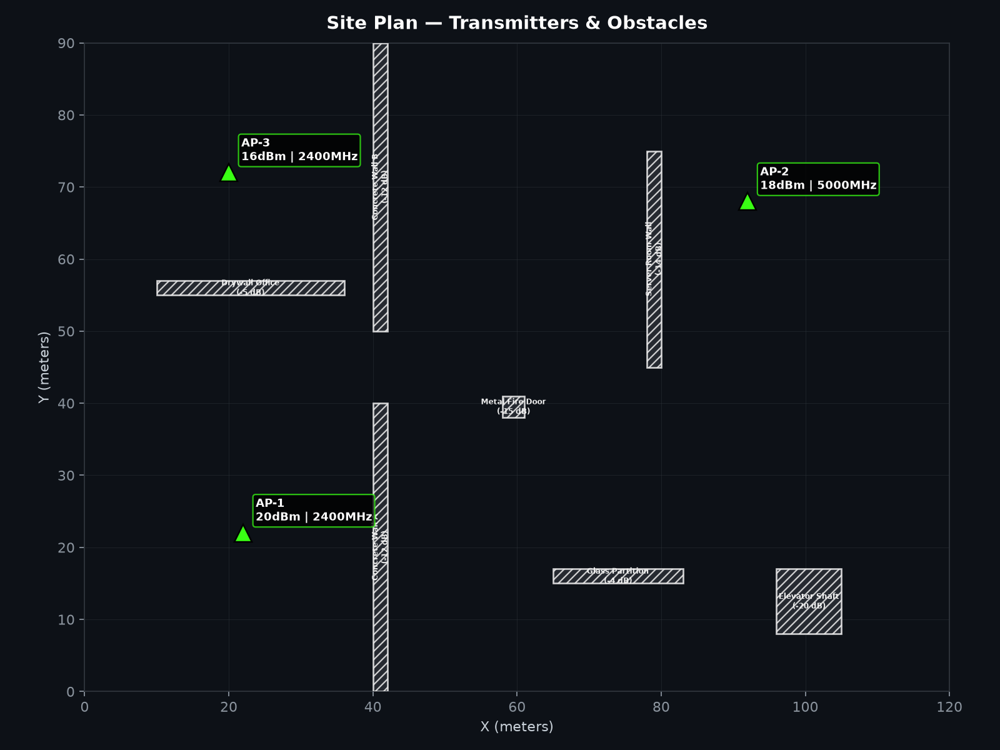

<div align="center">


# 📡 Wireless Network Coverage Planner

**A Python-based RF coverage simulator for Wi-Fi / Base Station networks — path loss, obstacles, heatmaps, and coverage radius, all from first-principles physics.**


</div>

---


## 🖼️ Preview

<div align="center">

<p><em>All four core views generated in a single run — heatmap, coverage radius, path-loss curves, and site plan.</em></p>
</div>

---

## 📌 What This Is

This project is a **from-scratch RF planning simulator**, similar in spirit to tools like Ekahau or WiFi Planner, built entirely with **Python, NumPy, and Matplotlib** — no black-box libraries. Every signal value on every heatmap pixel is derived from real propagation formulas:

- **Free Space Path Loss (FSPL)** and the **Log-Distance path-loss model**
- **Ray–obstacle intersection** (Liang–Barsky line clipping) to apply wall/door/partition attenuation
- **Multi-transmitter "best server" combining** — every point on the map is served by whichever AP gives the strongest signal there
- A configurable **Rx sensitivity threshold** used to derive real coverage percentages and theoretical coverage radii

Drop in your own site dimensions, transmitter positions, and obstacle layout in `config.py`, run one command, and get a full set of RF planning visuals plus a CSV point-by-point report.

---

## ✨ Features

| Feature | Description |
|---|---|
| 📶 **Draw Transmitters** | Place multiple Wi-Fi APs / Base Stations with custom power, antenna gain, and frequency |
| 🌊 **Signal Propagation** | Physically-grounded FSPL and Log-Distance path-loss models |
| 🔥 **Heatmap** | Full-resolution signal-strength heatmap (dBm) across the entire site |
| 🧱 **Obstacles** | Walls, doors, partitions, and shafts modeled as rectangles with per-material dB attenuation |
| 📉 **Path Loss** | Distance-vs-loss curves comparing FSPL against the log-distance model per frequency band |
| ⭕ **Coverage Radius** | Theoretical line-of-sight radius per transmitter, plus a real obstructed-coverage map |
| 📊 **CSV Export** | Every simulated grid point exported with position, serving AP, signal strength, and coverage flag |
| 🖥️ **Dashboard** | A single combined 2×2 summary image for quick review |

---

## 🏗️ Architecture

```
                  User
                   │
                   ▼
          Simulation Parameters
       (Power, Frequency, Position)
                   │
                   ▼
         Propagation Model Engine
                   │
       ┌───────────┼────────────┐
       │           │            │
       ▼           ▼            ▼
  Path Loss    Obstacles    Distance
       │           │            │
       └───────────┼────────────┘
                   ▼
          Signal Strength Grid
                   ▼
           Heatmap Generator
                   ▼
          Coverage Visualization
                   ▼
             PNG + CSV Report
```

### 🔁 Simulation Workflow

```
Start
  │
  ▼
Place Transmitter
  │
  ▼
Generate Environment Grid
  │
  ▼
Calculate Distance
  │
  ▼
Calculate Path Loss
  │
  ▼
Apply Obstacle Loss
  │
  ▼
Compute Signal Strength
  │
  ▼
Generate Heatmap
  │
  ▼
Display Coverage Radius
  │
  ▼
Export Results
```

This workflow runs **once per grid cell, per transmitter** — the engine keeps the strongest signal at each point (the "best server"), exactly like a real multi-AP site survey.

---

## 📂 Project Structure

```
wireless-network-coverage-planner/
│
├── main.py                 # CLI entry point — orchestrates a full simulation run
├── config.py                # All tunable parameters: site size, APs, obstacles, models
├── simulator.py              # Simulation engine — wires everything together, exports results
├── propagation.py            # FSPL & log-distance path-loss models, coverage-radius solver
├── transmitter.py            # Transmitter (AP / Base Station) data model
├── obstacles.py               # Obstacle model + Liang-Barsky ray/rectangle intersection
├── heatmap.py                # Builds the 2-D signal-strength grid across the site
├── visualization.py           # All Matplotlib rendering (heatmap, contours, dashboard...)
├── utils.py                   # Unit conversions, geometry & CSV helpers
│
├── assets/
│   ├── floor_plan.png         # Reference floor plan
│   ├── office_map.png         # Reference desk layout
│   └── logo.png                # Project logo
│
├── outputs/                    # Generated on every run
│   ├── heatmap.png
│   ├── signal_strength.png
│   ├── coverage_radius.png
│   ├── path_loss.png
│   └── simulation_report.csv
│
├── screenshots/                # Same visuals, kept for this README
│   ├── dashboard.png
│   ├── heatmap.png
│   ├── obstacles.png
│   ├── propagation.png
│   └── coverage.png
│
├── requirements.txt
├── LICENSE
├── README.md
└── .gitignore
```

---

## ⚙️ Installation

```bash
git clone https://github.com/your-username/wireless-network-coverage-planner.git
cd wireless-network-coverage-planner
pip install -r requirements.txt
```

Requires **Python 3.9+**. Only two dependencies: `numpy` and `matplotlib`.

---

## ▶️ Usage

Run the default simulation (uses the site defined in `config.py`):

```bash
python main.py
```

Console output looks like this:

```
================================================================
 WIRELESS NETWORK COVERAGE PLANNER
================================================================
 Area            : 120 x 90 m
 Resolution      : 1.0 m/cell
 Path-loss model : log_distance (n=3.0)
 Rx sensitivity  : -75 dBm
----------------------------------------------------------------
[Simulator] Building 120x90 m grid @ 1.0 m resolution (3 transmitters, 7 obstacles)...
[Simulator] Signal strength grid complete.
[Simulator] CSV report exported (10800 grid points).
[Simulator] All visuals exported to ./outputs/ and ./screenshots/
----------------------------------------------------------------
 TRANSMITTER SUMMARY
  AP-1      EIRP= 22.0 dBm    2400 MHz   theoretical radius ≈   79.2 m
  AP-2      EIRP= 21.0 dBm    5000 MHz   theoretical radius ≈   44.9 m
  AP-3      EIRP= 18.0 dBm    2400 MHz   theoretical radius ≈   58.2 m
----------------------------------------------------------------
 Overall coverage : 69.2% of area ≥ -75 dBm
 Outputs saved to : ./outputs/  and  ./screenshots/
================================================================
```

### CLI options

```bash
python main.py --model fspl                 # use free-space path loss instead of log-distance
python main.py --threshold -70               # stricter Rx sensitivity
python main.py --width 150 --height 100      # bigger site
python main.py --resolution 0.5              # higher-fidelity grid (slower)
python main.py --exponent 4.0                # denser environment (more attenuation with distance)
```

To change the transmitter layout, obstacle placement, or frequencies used, edit `config.py` directly — no code changes required.

---

## 🖥️ Screenshots

### 🔥 Signal Heatmap
Full-resolution received-signal-strength map (dBm) combining every transmitter's contribution, with obstacles and AP positions overlaid.

<div align="center"></div>

### ⭕ Coverage Radius
Binary covered/not-covered map against the configured Rx sensitivity threshold, with dashed circles showing each transmitter's theoretical (obstacle-free) line-of-sight range.

<div align="center"></div>

### 📉 Path Loss vs. Distance
Free-space vs. log-distance path-loss curves for every frequency band in use — the theoretical backbone behind every heatmap pixel.

<div align="center"></div>

### 🧱 Site Plan / Obstacles
Transmitter placement and obstacle layout (walls, doors, partitions) with per-object attenuation labeled, useful for validating your `config.py` before running a full simulation.

<div align="center"></div>

### 📊 Combined Dashboard
All views combined into a single exportable summary image.

<div align="center"></div>

---

## 🧮 The Physics

**Free Space Path Loss (FSPL):**

```
FSPL(dB) = 20·log10(d_km) + 20·log10(f_MHz) + 32.44
```

**Log-Distance Path Loss** (used indoors, generalizes FSPL with a path-loss exponent `n`):

```
PL(d) = PL(d0) + 10·n·log10(d / d0)
```

| Environment | Typical `n` |
|---|---|
| Free space | 2.0 |
| Open office | 2.5 – 3.0 |
| Office with walls | 3.0 – 4.0 |
| Dense / concrete building | 4.0 – 5.0 |

**Received signal at any point:**

```
Rx(dBm) = EIRP − PathLoss(distance) − ObstacleLoss
EIRP    = Tx Power (dBm) + Antenna Gain (dBi)
```

Obstacle loss is computed by testing the direct ray between transmitter and receiver against every obstacle rectangle with the **Liang–Barsky line-clipping algorithm**, summing the attenuation (dB) of every obstacle the ray physically crosses.

At every grid point, the simulator evaluates **every transmitter** and keeps the **strongest signal** — this "best server" logic is what real multi-AP coverage maps use.

---

## 📄 Output Files

| File | Description |
|---|---|
| `outputs/heatmap.png` | Full signal-strength heatmap |
| `outputs/signal_strength.png` | Discrete-band filled contour version of the heatmap |
| `outputs/coverage_radius.png` | Covered/not-covered map + theoretical radius circles |
| `outputs/path_loss.png` | Path-loss curves per frequency/model |
| `outputs/simulation_report.csv` | Every grid point: `x_m, y_m, best_server, signal_dbm, covered` |

---

## 🛣️ Possible Extensions

- Multi-floor / 3-D propagation with floor-to-floor attenuation
- Interference & channel-overlap analysis for co-located APs
- Import real floor plans (image) and click-to-place obstacles/transmitters
- Interactive version using `ipywidgets` or a small Flask/Streamlit front end
- Shadowing (log-normal fading) for more realistic Monte-Carlo coverage estimates

---

## 📜 License

Released under the [MIT License](LICENSE).
=======
# wireless-network-coverage-planner
A Python-based Wireless Network Coverage Planner that simulates RF signal propagation, path loss, coverage radius, obstacle attenuation, and heatmap visualization for WiFi and cellular base stations.
